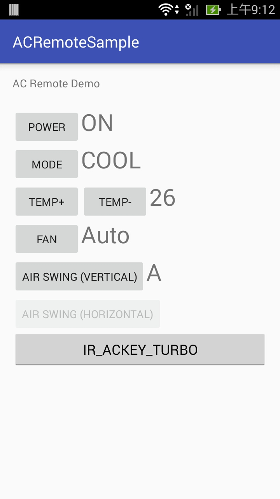

# bomeans_sdk_ac_demo_android
This demo program demonstrates how to make your GUI to interact with the Bomeans IR SDK.

## How AC Remote Controller Works?

Remote controllers of air conditioners act very different from general TV remote controllers.

For TV remote controller (and the like), pressing a key will transmit a fixed IR waveform. But for typical remote controllers of air conditioners, especially those controllers with LCD display panel, do not transmit fixed IR waveform when you press a key. Actually, everytime you press a key, the remote controller will collect its internal states such as the power state, mode state, temperature, fan speed, air swing, etc. to compose the IR signals. This signals is then transmitted to synchronize the states of the target air conditioner.

## How Does Bomeans SDK Handles the AC Remote Controller Codes?

The Bomeans IR database and the associated SDK is then design to handle the above situation in order to allow the user to create remote controllers that behave just like the real remote controller.

### Key Options

For this reason, each key you got from an AC remote controller usually contains some associated "key options" for you to set the internal state of the AC remote controller. For example, you will see [on] and [off] options associated with the [power] key. When you want to power on the AC machine, you should specify the [on] option when press the [power] key.

### Keep and Restore States

All the options set to the created AC remote controller will be kept and tracked internally. But if the created AC remote controller instance needs to be closed and re-created, you can retrieve the internal states and save it in storage, and inject those states into the re-created AC remote controller. In such way the AC remote controller can hold the internal states across the life cycle of the App.

### More on the Temperature Setting

However, you might still feel confusing such as you do not get a [Temperature Up]/[Temperature Down] key from the key list of a AC remote controller. Instead you got a single [Temperature] key. This is because when you press the [Temperature Up] or [Temperature Down] key, the AC remote controller will calculate the actual degree by stepping forward or backward by one, then send this specific degree out to the AC machine. That is, for the App, you can set the temperature to any available degree without the need to step up/down one by one. For example, you can just specify the temperature to 20 degree regardless of the current temperature is set to 16 degree or 25 degree.

### Traditional Temperature Up/Down Keys

If you do not feel comfortable with the temperature setting design, you can simply convert the [Temperature] key to [Temperature Up] and [Temperature Down] keys with some tweak. Check the Demo 1.

We also provide a BIRAcRemote wrapper which does the temperature key conversion for you. Simply add this class into your project, and create a BIRAcRemote instance by passing the created BIRRemote as parameter. The newly created BIRAcRemote works just as the originally created BIRRemote, but you got [temperature up]/[temperature down] keys from the BIRAcRemote instead of getting single [temperature] key from BIRRemote.

## Demo
Three demo activities are included:
* Demo 1: Basic demo. The temperature is mapped into temp+ and temp- keys just like the ordinary physical AC remote controllers.
* Demo 2: Similar to Demo 1, but using a wrapper for the generated remote to make the temperature keys mapping easier.
* Demo 3: Similar to Demo 1, but using slide bar (seek bar) for the temperature setting.

## About API Key
You need to apply an Bomeans IR API Key for this demo code to run.

## Demo App Screen Shot

